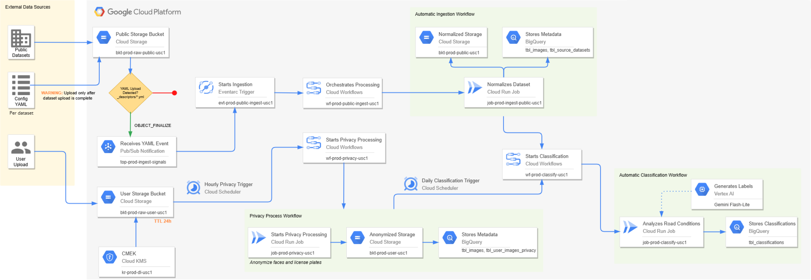
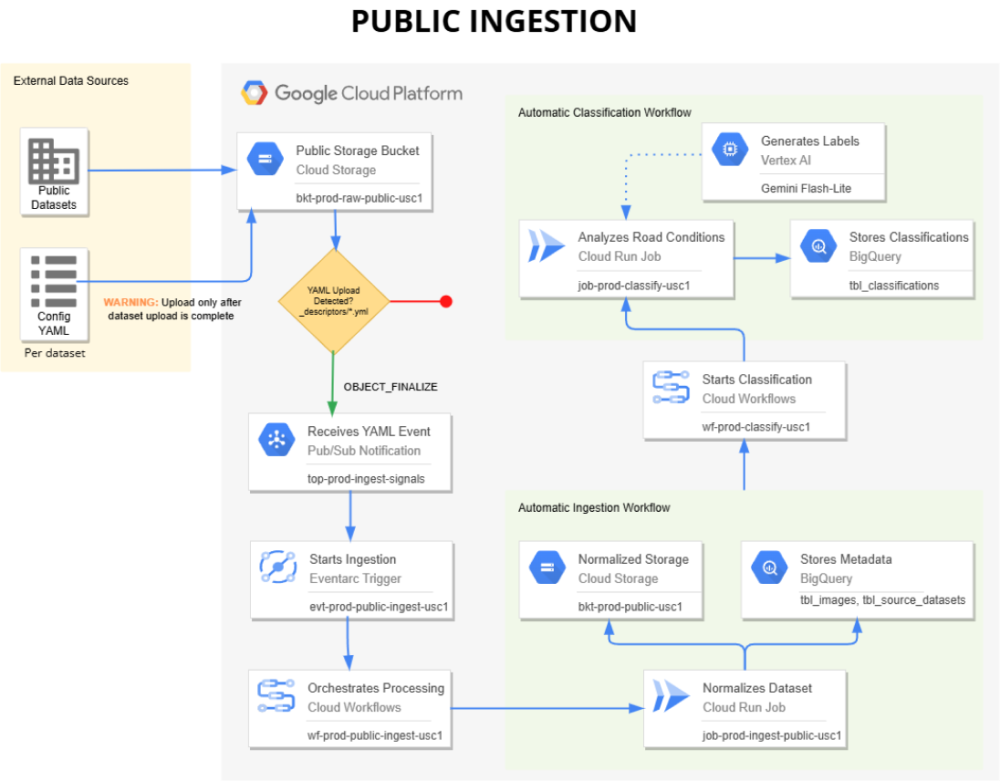
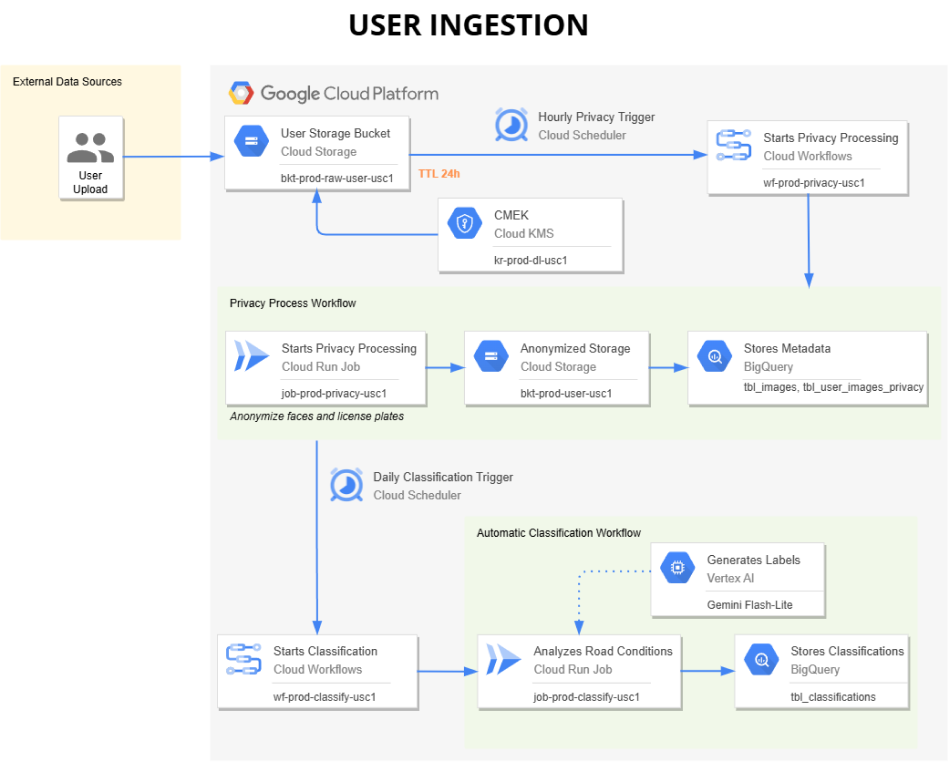
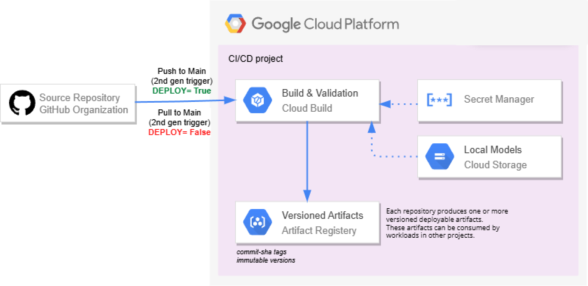

# Data Lake — VisualRoad Data Lake (infraestructura GCP)

Infraestructura **Google Cloud** del Data Lake de Visual Road: ingiere datasets
públicos de detección de carriles y capturas de dashcam de usuario, **anonimiza la
PII**, **clasifica** la escena y lo cataloga todo en BigQuery para alimentar el
entrenamiento del modelo de carriles.

---

## Overview

* **Qué hace.** Tres pipelines sobre Cloud Run + Workflows: (1) normaliza datasets
  públicos al layout propio, (2) anonimiza caras/matrículas de las imágenes de usuario
  (irreversible) y (3) clasifica clima/escena/franja/geometría. Todo queda catalogado
  en BigQuery (metadatos, auditoría, clasificación).
* **Por qué existe.** Centraliza y normaliza datos heterogéneos (públicos + usuario)
  en un formato común, con seudonimización y cumplimiento de privacidad, para servir
  de fuente de entrenamiento.
* **Encaje en Visual Road.** Es la **capa de datos**: produce las imágenes limpias y
  sus metadatos/etiquetas. **No** cubre el modelo ni el repositorio `LaneTR`.

Proyectos: datos `vr-prj-prod-data-v1` (`us-central1`), CI/CD `vr-prj-dev-cicd-v1`.

---

## Architecture

Tres jobs de Cloud Run (imágenes en Artifact Registry), orquestados por Cloud
Workflows y disparados por Cloud Scheduler / Eventarc; el estado vive en GCS (imágenes)
y BigQuery (metadatos). Una `libs/` compartida da el acceso a GCS/BigQuery/Vertex y el
paralelismo. Aislamiento por SA: una cuenta de servicio por job, permisos mínimos a
nivel de recurso (ver [IAM.md](docs/architecture/IAM.md)).

### Architecture Diagram



El crudo público entra por descriptor (Eventarc) y el crudo de usuario por scheduler.
`ingest-public` normaliza y `privacy` anonimiza; ambos catalogan en `tbl_images`, y
`classify` consume ese catálogo. Cada job hace **upsert idempotente por `MERGE`** en
BigQuery (ver [bigquery.md](docs/architecture/bigquery.md)).

---

## Flows

### Ingesta pública



* **Purpose:** normalizar un dataset público (CULane, CurveLanes…) al layout propio.
* **Trigger:** subir `_descriptors/<dataset>.yml` a `bkt-prod-raw-public-usc1` →
  notificación GCS → Pub/Sub `top-prod-ingest-signals` → Eventarc → workflow.
* **Input:** dataset crudo en `bkt-prod-raw-public-usc1/<dataset>/`.
* **Output:** imágenes + `.lines.json` + `<split>.txt` en `bkt-prod-public-usc1`;
  filas en `tbl_images` y `tbl_source_datasets`. Encadena `wf-prod-classify-usc1`.
* **Components:** `wf-prod-public-ingest-usc1` → `job-prod-ingest-public-usc1`.

### Ingesta de usuario (anonimización + clasificación)



* **Purpose:** anonimizar el crudo de usuario y clasificar las imágenes limpias.
* **Trigger:** `sched-prod-privacy-usc1` (cada hora) → `job-prod-privacy-usc1`;
  `sched-prod-user-classify-usc1` (diario 00:00) → `wf-prod-classify-usc1`.
* **Input:** `bkt-prod-raw-user-usc1/<user_id>/<session_id>/images/...` (PII, CMEK, TTL 24 h).
* **Output:** imágenes anonimizadas en `bkt-prod-user-usc1`; `tbl_user_images_privacy`
  (auditoría) + `tbl_images` (catálogo `source='user'`); luego `tbl_classifications`.
* **Components:** `job-prod-privacy-usc1` (YOLOv8 CPU) → `job-prod-classify-usc1` (Gemini).

### CI/CD (build & deploy)



* **Purpose:** test → build → push → actualizar el job.
* **Trigger:** push/PR filtrado por `includedFiles` (un trigger por servicio).
* **Input:** código del servicio + `libs/` (+ el `.pt` del modelo en privacy).
* **Output:** imagen `<servicio>:$SHORT_SHA` en el repo `datalake`; `gcloud run jobs update`.
* **Components:** Cloud Build (`sa-cicd-deployer`) → Artifact Registry → Cloud Run.

---

## Components

### job `privacy`

* **Purpose:** anonimiza caras/matrículas del crudo de usuario con un detector
  **YOLOv8 en CPU, por lotes** (`dashcam_anonymizer`, `ANON_METHOD=detector`). Sin Gemini.
* **Dependencies:** `libs/{config,gcs,bigquery}`, ultralytics + torch CPU + opencv; el
  `.pt` horneado en la imagen.
* **Responsibilities:** lista raw-user → anti-join contra `tbl_user_images_privacy` →
  difumina → sube limpio a `bkt-prod-user-usc1` → MERGE en `tbl_user_images_privacy` +
  `tbl_images`. Checkpoint incremental; no borra el crudo (TTL 24 h).

### job `ingest-public`

* **Purpose:** normaliza datasets públicos al layout común.
* **Dependencies:** `libs/{config,gcs,bigquery,parallel}`, adaptadores por dataset.
* **Responsibilities:** lee el descriptor, recorre las muestras (en paralelo), copia
  imágenes + normaliza `.lines.json`, escribe `<split>.txt` y MERGE en `tbl_images` +
  `tbl_source_datasets`.

### job `classify`

* **Purpose:** clima/escena/franja/geometría con Gemini en Vertex.
* **Dependencies:** `libs/{config,gcs,bigquery,vertex,parallel}`, `google-genai`.
* **Responsibilities:** anti-join `tbl_images`↔`tbl_classifications` → clasifica en
  paralelo (reintento con backoff) → MERGE en `tbl_classifications`. Checkpoint incremental.

### `libs/` (compartida)

* `config.py` (Settings), `gcs.py` (Storage con reintentos), `bigquery.py` (upsert por
  MERGE), `vertex.py` (Gemini), `parallel.py` (`imap_unordered` acotado).

### Orquestación

* **Workflows:** `wf-prod-public-ingest-usc1`, `wf-prod-classify-usc1`.
* **Schedulers:** `sched-prod-privacy-usc1` (horario), `sched-prod-user-classify-usc1` (diario).
* **Eventarc:** `evt-prod-public-ingest-usc1` (descriptor → workflow de ingesta).

---

## Repository Structure

```text
.
├── cloudbuild.yaml              # test → build → push → update (por servicio)
├── deploy/env.yaml              # variables de entorno (fuente única: CI + jobs)
├── libs/                        # librería compartida por los 3 jobs
│   ├── config.py  gcs.py  bigquery.py  vertex.py  parallel.py
├── jobs/
│   ├── ingest-public/           # src/, Dockerfile, requirements.txt
│   ├── classify/                # src/, scripts/preview_classify.py, Dockerfile
│   └── privacy/                 # src/{main,anonymizer}.py, scripts/preview_privacy.py
├── tests/
│   ├── conftest.py              # fixture `cloud` (GCP real, solo lectura) + truststore
│   ├── libs/  jobs/<servicio>/  # tests por job (CI corre tests/jobs/<svc> + tests/libs)
├── docs/
│   ├── architecture/            # IAM.md, storage.md, bigquery.md
│   └── diagrams/                # *.png
└── README.md
```

---

## Configuration

* **Variables de entorno:** una fuente única en `deploy/env.yaml` (la cargan tanto el
  CI como los jobs desplegados); plantilla documentada en `.env.example`. Incluyen
  proyecto/región, modelo Gemini, buckets, nombres de datasets/tablas, `ANON_METHOD`,
  y la concurrencia **por job** (`CLASSIFY_WORKERS`, `INGEST_WORKERS`, `PRIVACY_WORKERS`,
  `PRIVACY_BATCH`). Opcionales (leídas directas del entorno): `*_CHECKPOINT`, `PRIVACY_MODEL_PATH`.
* **Secrets:** ninguno en el repo. En runtime los jobs usan la **SA del job** (sin
  claves); en local, ADC (`gcloud auth application-default login`).
* **APIs necesarias:** Cloud Run, Cloud Build, Artifact Registry, Cloud Storage,
  BigQuery, Vertex AI, Workflows, Eventarc, Pub/Sub, Cloud KMS.
* **Cifrado:** CMEK (`key-prod-dl-cmek`) en los buckets de usuario; lo aplica el agente
  de GCS, no los jobs.

---

## Deployment

* **SA de despliegue:** `sa-cicd-deployer@vr-prj-dev-cicd-v1` (ver [IAM.md](docs/architecture/IAM.md)).
* **Cloud Build** (un trigger por servicio, filtrado por `includedFiles`):
  `test (ruff + pytest) → build → push a datalake → gcloud run jobs update`. Para
  privacy, un paso `fetch-model` baja el `.pt` de `bkt-prod-models-usc1` y lo hornea.
* **Creación inicial:** el job se crea **una vez** (con su `--service-account`, recursos
  y `--env-vars-file=deploy/env.yaml`); el CI luego solo **actualiza la imagen**.
* Imagen: `us-central1-docker.pkg.dev/vr-prj-dev-cicd-v1/datalake/<servicio>:<sha>`
  (tags inmutables, Container Scanning activado).

---

## Operations

### Ejecutar un job (dry-run de prueba)

* **Procedure:** `gcloud run jobs execute job-prod-<servicio>-usc1 --region=us-central1
  --project=vr-prj-prod-data-v1 --wait`. Los jobs aceptan `--dry-run` y `--limit N`
  (clasifican/anonimizan pero no escriben). Logs: `gcloud logging read
  'resource.type="cloud_run_job" AND resource.labels.job_name="job-prod-<servicio>-usc1"'`.
* **Expected Result:** resumen final `OK {...}` con conteos; en dry-run, sin escrituras.

### Probar en local (sin desplegar)

* **Procedure:** `pytest tests/jobs/<servicio> tests/libs` (acceden a GCP real en solo
  lectura; se saltan si no hay ADC). Previews visuales: `jobs/classify/scripts/preview_classify.py`
  y `jobs/privacy/scripts/preview_privacy.py` (salen a `previews/`).
* **Expected Result:** tests verdes / pares original+blur en `previews/`.

---

## Mejoras futuras (roadmap)

1. **Cola de revisión por confianza.** Encolar en `tbl_label_review_status`
   (`status='pending'`) los frames cuyo `confidence` del modelo edge sea
   `< CONF_THRESHOLD` (0.40), tomando `confidence`/`num_lines` del `.lines.json`. Queda
   pendiente fijar el esquema de ese JSON. (Lo escribiría el job de privacy; su SA ya
   contempla acceso a esa tabla.)

2. **`road_geometry` calculado en local (menos tokens).** Derivar `curve`/`straight` de
   la **curvatura de los puntos del `.lines.json`** en vez de preguntárselo a Gemini.
   La columna `geometry_at` de `tbl_classifications` ya está prevista para registrar
   ese cálculo aparte de `classified_at`.

3. **Muestreo temporal en secuencias de usuario.** Como dentro de una sesión el
   clima/escena/franja **no cambian**, clasificar **1 frame cada X** (o uno
   representativo por `session_id`) y propagar la etiqueta al resto de la sesión →
   menos llamadas a Gemini. Se combina con (2): la geometría sí por frame (barata,
   local), el resto por sesión.

---

## Documentación

* [docs/architecture/IAM.md](docs/architecture/IAM.md) — cuentas de servicio, roles y agentes.
* [docs/architecture/storage.md](docs/architecture/storage.md) — buckets de GCS y layout de carpetas.
* [docs/architecture/bigquery.md](docs/architecture/bigquery.md) — datasets y tablas.

---

## License

See LICENSE. El detector de anonimización reutiliza el modelo del repositorio MIT
[`dashcam_anonymizer`](https://github.com/varungupta31/dashcam_anonymizer) (YOLOv8).
